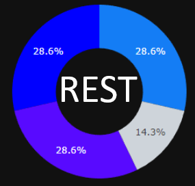

<<<<<<< HEAD



=======
>>>>>>> 97a4ccd73d500ba2467f19750fbc9805b9814cd7
# REST-interface

REST is a jupyter interface that helps the user to assess the application of rules-based method, regarding entities of interest highlighted in a corpus. 

In information extraction tasks, both machine learning and rules are available methods. Although the two processes are well-known and used, there is no obvious way or good practice to decide which one is the most appropriate for each project. 

Using highlights from the BRAT annotation tool, REST is part of an approach to evaluate a rules-based system quickly.

<<<<<<< HEAD


## Video presentation

An explanation of REST-interface is available here :
[Video presentation](https://vimeo.com/1005460293?share=copy)
=======
>>>>>>> 97a4ccd73d500ba2467f19750fbc9805b9814cd7
## Getting started

### 1. Clone the Repository

First, clone the repository to your local machine:
```bash
git clone https://github.com/GuiGuiBazin/REST-interface.git
```
### 2. Install Dependencies
Install the required packages listed in requirements.txt:
```bash
pip install -r requirements.txt
```
### 3. Download the spaCy Model
Download the spaCy model required by the project:
```bash
python -m spacy download fr_core_news_sm
```

### Notes: 
- Spacy model download is absolutly necessary for the current version of REST. More models for other languages will be integrated in later updates. 
- If you encounter any issues with dependencies, check that your environment matches the versions specified in requirements.txt.
<<<<<<< HEAD
=======


>>>>>>> 97a4ccd73d500ba2467f19750fbc9805b9814cd7
## Acknowledgements

I would like to thank Emmanuelle Kempf and Xavier Tannier for supervising this project. 

